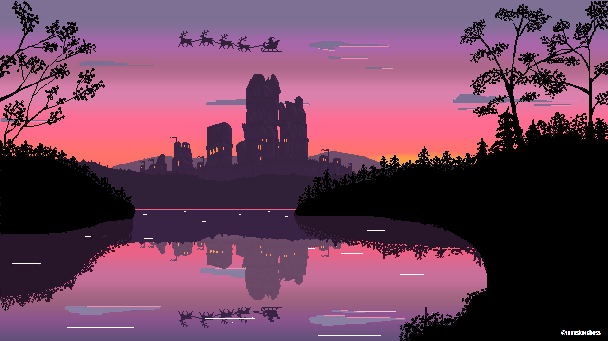

# ✍️Caça palavras
Um caça palavras cujo tema é voltado à sustentabilidade , a fim de fixar conceitos básicos para a melhor compreensão do tema em questão

## 💻Tecnologias utilizadas
Html, Css e JavaScript.

## 🤓Integrantes
|         Nome         |      Github       |        Contato        |
|----------------------|-------------------|-----------------------| 
| Clara D´avila        | [Clara Elisa](https://github.com/Claraelisa05)     |  claraelisa5198@gmail.com |
| Guilherme Rodrigues  | [guirodrigues26](https://github.com/guirodrigues26)  | guicastorsilva@gmail.com |
| Luciana Flores       | [LuciFlores208](https://github.com/LuciFlores208)   | luci.barbosaflores@gmail.com  |                                

## 📝Como jogar
Utilizando o mouse , o jogador deverá clicar nas letras e arrastar formando a palavra em questão.

## ▶️Como executar o projeto
Executaremos o projeto utilzando ferramentas como Css , Html e JavaScript, dentro do Visual Studio Code.

## 🛠️Funcionalidade
A base do nosso código será realizada através dos 3 pilares - Html , Css e JavaSript.

## 📈Melhorias futuras
Temos duas melhorias possíveis para po nosso projeto, a primeira sendo a otimização do código , pois ainda não possuímos um grande conhecimento a respeito do JavaScript, a segunda seria
o game design , pois como é o primeiro jogo que estamos elaborando ele não vai representar o nosso potencial máximo em sua programação. 

## ❗❗❗Objetivos do jogo
- Promover a sustentabilidade
- Incentivar as novas gerações a se preocuparem com o meio ambiente
- Explicar de forma didática e simplificada o tema
- Incentivar a conciência ambiental

## ⚙️Mecânica principal 
O mouse do usuário, pois se trata de um caça-palavras simples , mas eficiente.

## 🎯Público-alvo
Público em geral.

## 🤔Nossa motivação
Nossa principal motivação é trazer para nova geração um jogo sobre o tema sustentabilidade. Para fortalecer a educação (não muito valorizada nas escolas) sustentável e formar certo pensamento crítico nos jovens quanto o cuidado ao planeta terra.

## 📚 História dos personagens/ Cenários
Se trata apenas de um jogo simples de caça-palavras referente ao assunto(sustentabilidade) onde também haverá dicas opcionais para o jogador.

## imagens

  

